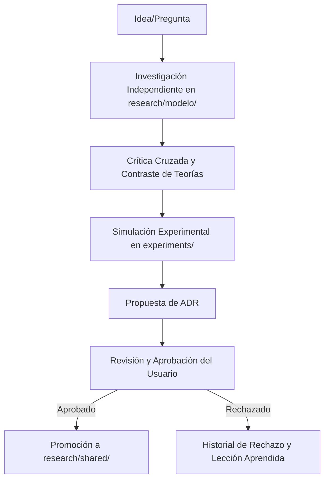

# 🏛️ FKT Research Laboratory Architecture & Guidelines (docs/RESEARCH_LAB_ARCHITECTURE.md)

Este documento define la arquitectura organizativa, metodológica y operativa del laboratorio de la **Teoría del Conocimiento Finito (FKT)**. Está estructurado para soportar años de investigación científica independiente realizada de forma simultánea por investigadores humanos y agentes de IA.

---

## 1. Complete Research Repository Architecture

El repositorio FKT se estructura como un grafo de directorios acoplados conceptualmente por flujo de dependencias, pero aislados físicamente para prevenir colisiones de escritura:

```txt
finite-knowledge-theory/
├── README.md               # Presentación humana y principios
├── AGENTS.md               # Instrucciones operativas de agentes
├── GEMINI.md               # Directrices para modelos Gemini
├── LICENSE                 # Términos de licenciamiento
├── prompts/                # Prompts maestros del repositorio
├── docs/                   # Guías organizativas e historial
│   ├── RESEARCH_LAB_ARCHITECTURE.md  # Este estándar
│   ├── CHANGELOG.md        # Registro de cambios SemVer
│   └── agent/              # Límites, runbooks, configuración y seguridad
├── research/               # Núcleo de investigación científica
│   ├── README.md           # Mapa de fases
│   ├── shared/             # Consenso científico aprobado
│   ├── gpt/                # Espacio de trabajo exclusivo de GPT
│   ├── claude/             # Espacio de trabajo exclusivo de Claude
│   ├── gemini/             # Espacio de trabajo exclusivo de Gemini
│   ├── deepseek/           # Espacio de trabajo exclusivo de DeepSeek
│   └── future-models/      # Espacio para modelos futuros
├── adr/                    # Registro de Decisiones Arquitectónicas (ADRs)
├── specification/          # Estándares oficiales independientes de código
├── reference-implementation/ # Implementaciones de software (Python, Rust, etc.)
├── validation/             # Vectores de pruebas agnósticos
├── benchmarks/             # Pruebas comparativas de rendimiento
├── experiments/            # Ensayos y código de simulación reproducible
├── examples/               # Casos de uso prácticos
└── scripts/                # Automatización y validaciones del repo
```

---

## 2. Directory Responsibilities

Cada directorio tiene una responsabilidad única y un contrato claro:

| Directorio | Responsabilidad Única | Escritores Permitidos |
| :--- | :--- | :--- |
| `research/shared/` | Almacena conclusiones científicas aprobadas por el usuario. | Sólo mediante flujo de promoción formal. |
| `research/[modelo]/` | Espacio aislado de investigación independiente de cada IA. | Exclusivo del modelo correspondiente. |
| `specification/` | Estándares formales conceptuales e independientes de lenguaje. | Chief Specification Architect. |
| `adr/` | Decisiones arquitectónicas y teóricas justificadas. | Todos (sujeto a aprobación humana). |
| `experiments/` | Simulaciones cortas y reproducibles para validar hipótesis. | Investigadores (Humanos / IAs). |
| `reference-implementation/` | Software que implementa la especificación. | Principal Software Architect. |
| `validation/` | Suite de pruebas agnóstica para conformidad cruzada. | Principal Software Architect. |
| `docs/agent/` | Instrucciones de configuración, seguridad y permisos de IA. | Todos. |

---

## 3. Documentation Strategy

Toda la documentación debe tratarse bajo el estándar de **"Documentation as Code"**:
*   **Formato Único:** Markdown estándar.
*   **Tipografía Científica:** Las expresiones matemáticas deben escribirse usando notación LaTeX estándar (`\(...\)` para inline, `\[...\]` o `$$...$$` para bloques).
*   **Auto-Contenido:** Cada carpeta contiene un `README.md` que detalla sus objetivos activos y estado, permitiendo que un investigador nuevo comprenda el contexto local de forma inmediata.

---

## 4. Multi-Agent Collaboration Model

Para permitir la investigación en paralelo por múltiples modelos (ej. Claude, Gemini, GPT) sin interferencias ni conflictos de fusión Git:

*   **Aislamiento Físico:** Cada modelo trabaja en su propio directorio `research/[modelo]/`. Está estrictamente prohibido que un modelo modifique los archivos de otro.
*   **No Contaminación de Contexto:** Las conversaciones e historiales de chat no son parte del repositorio. La memoria común se construye a través de archivos markdown estables.
*   **Revisión Crítica Cruzada:** Un modelo puede leer el directorio de otro modelo para desafiar sus suposiciones o contrastar resultados en un documento de análisis, pero siempre escribiendo en su propia carpeta.

---

## 5. ADR (Architectural Decision Record) Strategy

Las decisiones teóricas y arquitectónicas clave se documentan mediante ADRs para garantizar la trazabilidad:
*   **Cuándo abrir un ADR:** Cuando una investigación propone un cambio de diseño, introduce un nuevo nivel fundacional, define un formato de serialización o descarta una hipótesis previa.
*   **Ciclo de Vida del ADR:**
    1.  `Proposed`: La decisión está siendo evaluada.
    2.  `Accepted`: Aprobada formalmente por el usuario.
    3.  `Rejected`: Descartada basándose en evidencia.
    4.  `Superceded`: Reemplazada por un ADR posterior.

---

## 6. Research Workflow

Toda investigación debe seguir obligatoriamente este flujo para asegurar la calidad y el rigor científico:



---

## 7. Knowledge Promotion Workflow

El traspaso de un descubrimiento desde la investigación independiente a la base de conocimiento aprobada (`research/shared/`) requiere un proceso riguroso:

1.  **Validación de Evidencia:** El investigador debe aportar demostraciones matemáticas o código de simulación (con semillas reproducibles) que sustenten la conclusión.
2.  **Aprobación del ADR:** Se aprueba el ADR asociado.
3.  **Promoción y Enlace:** Se copia el documento final a `research/shared/`, incorporando los metadatos obligatorios en el frontmatter (referenciando la investigación original, el ADR y la justificación).

---

## 8. Historical Preservation Strategy

*   **Los fallos son valiosos:** Nunca elimines un documento de investigación o un experimento porque haya fallado. Los desvíos e hipótesis refutadas se marcan como `🔴 Rejected` y se conservan. Esto previene que futuros investigadores (o agentes en futuras sesiones) vuelvan a perder tiempo en caminos ya descartados.
*   **Control de Versiones Limpio:** No se permite reescribir la historia de Git (`git push --force`). La evolución teórica debe ser legible a través del historial de commits.

---

## 9. Repository Navigation Guidelines

Un nuevo investigador (humano o agente) que llegue al proyecto debe seguir esta ruta de onboarding:

1.  **Nivel 1 (Visión):** Leer [README.md](../README.md) y [AGENTS.md](../AGENTS.md).
2.  **Nivel 2 (Organización):** Leer este archivo (`RESEARCH_LAB_ARCHITECTURE.md`).
3.  **Nivel 3 (Estado del Arte):** Leer [research/shared/README.md](../research/shared/README.md) y los documentos aprobados allí enlazados.
4.  **Nivel 4 (Paso Activo):** Consultar la sección `Next Investigation` de los últimos documentos de investigación para identificar qué pregunta debe resolverse a continuación.

---

## 10. Future Scalability Recommendations

A medida que el proyecto crezca en los próximos años, se aconseja:
*   **Automatización de Enlaces:** Implementar un linter Git Hook en `scripts/` que impida hacer commits si existen enlaces rotos.
*   **Aislamiento por Submódulos:** Si las implementaciones de código (`reference-implementation/`) crecen exponencialmente, modularizarlas en submódulos Git separados para mantener el repositorio principal enfocado puramente en la teoría y especificación.
