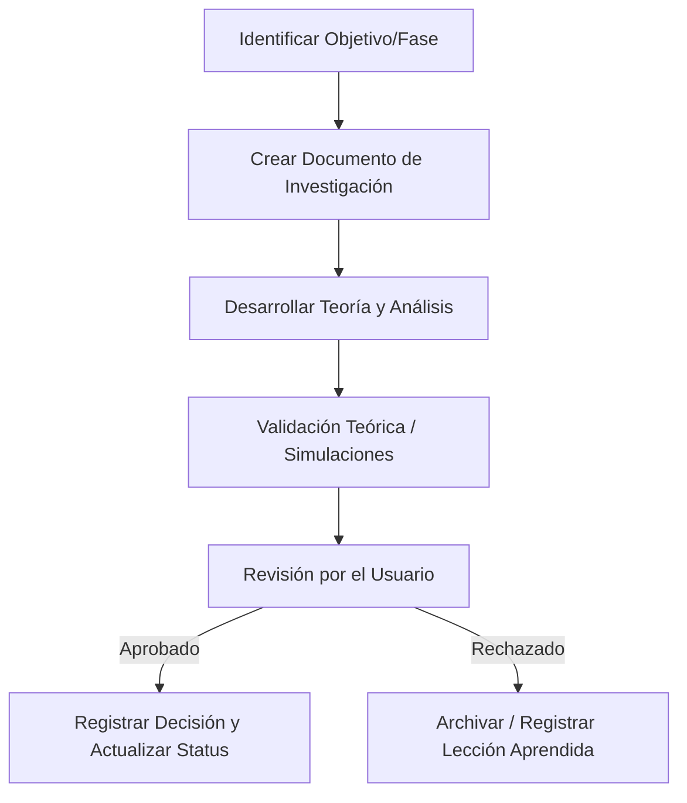

# 📖 Runbook Operativo (RUNBOOK.md)

Este documento describe cómo operar en el laboratorio de investigación, estructurar los hallazgos y ejecutar simulaciones a lo largo del roadmap de FKT.

---

## 1. Ciclo de Vida de una Investigación

Toda investigación en este repositorio pasa por el siguiente ciclo:

---

## 2. Cómo Iniciar una Investigación

1.  **Crear Carpeta de Fase:** Crea una carpeta bajo `research/` correspondiente a la fase del roadmap (ej. `research/phase-1-primitives/`).
2.  **Generar Documento:** Crea un archivo markdown para documentar el estudio (ej. `definition_of_primitives.md`).
3.  **Aplicar Estructura Obligatoria:** El archivo debe usar exactamente el formato de 8 secciones (ver [DATA_SCHEMA.md](DATA_SCHEMA.md) o usa el skill `research-document`).
4.  **Establecer Status Inicial:** Inicializa el status del documento como `Status: 🟡 Research`.

---

## 3. Registro de Decisiones y Avances

*   Una decisión teórica **nunca** se da por aprobada de forma autónoma. El agente debe proponer el análisis, argumentar la decisión recomendada y esperar la aprobación explícita del usuario.
*   Una vez aprobada la decisión por el usuario:
    1. Cambia el status del documento a `Status: 🟢 Approved` (o `🔴 Rejected` si la hipótesis fue refutada).
    2. Actualiza [docs/CHANGELOG.md](../CHANGELOG.md) detallando qué se decidió y por qué.
    3. Si afecta el diseño conceptual, actualiza [docs/agent/DATA_SCHEMA.md](DATA_SCHEMA.md).

---

## 4. Ejecución de Experimentos y Simulaciones (Fase 5+)

Cuando se requiera validar teoría mediante código:

1.  **Aislamiento:** Todo código experimental debe correr en un entorno virtual de Python (`.venv`) o su equivalente según el lenguaje elegido.
2.  **Directorio de Código:** Guarda los scripts y notebooks en una subcarpeta `code/` dentro de la fase correspondiente (ej. `research/phase-5-experiments/code/`).
3.  **Logs de Simulación:** No subas gigabytes de datasets. Sube únicamente los scripts de generación, las semillas aleatorias usadas para reproducibilidad y resúmenes de resultados en markdown.
4.  **Reproducción:** El código de simulación debe incluir un script `run.sh` o `run.ps1` que permita al usuario o a futuros agentes reproducir el experimento con un solo comando.
